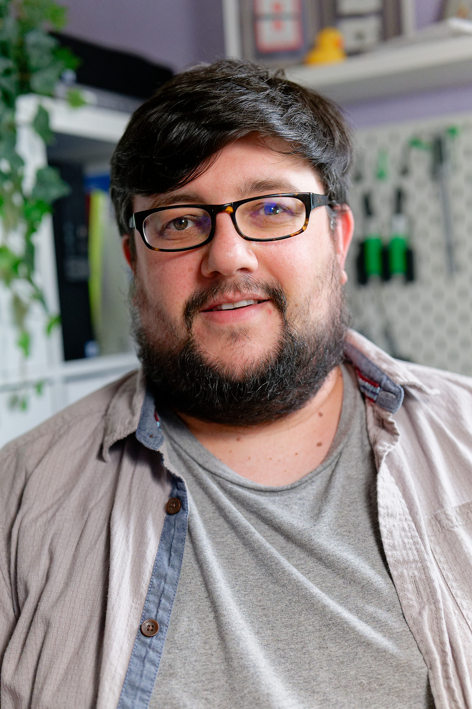

## Welcome
 

Hi and welcome, my name is Callum.

Please check out my:
- [Linkedin](https://www.linkedin.com/in/callumjfraser/)
- [Medium](https://medium.com/@callumjfraser)

## About Me
A leader and people manager passionate about inspiring and helping people become the best they can. I Love inspiring teams, mentoring and using the best technology and process to solve problems: through conversations, talks and support through mentorship and coaching. I am involved in organising and contributing to many community events across technology, leadership and management in Manchester, UK.

A Co-organiser @ [MancJS](https://www.meetup.com/mancjs/) and seasoned Software Engineering Manager with experience leading and inspiring teams @ [CreateFuture](www.createfuture.com) and in Greater Manchester. Demonstrated history of working in the finance, commercial and leisure & travel industry. 

## Support and Mentoring
I am always interested in helping anyone wanting to get into the tech/development/leadership in any way possibe. Often coaching and mentoring but I am always happy to take a look at anyones CV for feedback on [linkedin](https://www.linkedin.com/in/callumjfraser/). 

My [Markdown CV](cv) is available online for those interested

## Community Involvement
- Co-organiser @ [MancJS](https://www.meetup.com/mancjs/)
- Community Lead @ [Techs And The City](https://www.meetup.com/Techs-and-The-City/) 
- Volunteer @ [Manchester Tech Festival](https://www.manchestertechfestival.co.uk/)

## Projects
* [NorthWest Tech Resources](https://callumjfraser.github.io/NorthWestTech/)

## Achievemens
- [First Aider](https://tigerlilytraining.co.uk/verification/home/token/lxa6c1z2b6/)
- [PSM1 Certification](https://www.scrum.org/user/1118604)
- [Green Software for Practitioners Certification](https://ti-user-certificates.s3.amazonaws.com/e0df7fbf-a057-42af-8a1f-590912be5460/3f68ff1a-b4b7-4833-a440-29c5ba180a3b-callum-fraser-ad8f81f1-b0b4-4307-b4d9-c0c395f5f8cd-certificate.pdf)
- [(Cycling) 300 in 30 for Cancer Research UK](https://fundraise.cancerresearchuk.org/page/callums-cycle-300-fundraising-page-13)

## Talks
- Leadership Lessons From the Most Succesful English Football Team
- AMPing up your teams
- Turbocharging Your Career With AI
- Common Misconceptions in Tech
- Optimising for Understanding
- SOLID Typescript Principles

## Hobbies and Interests
- Cycling
- Sustainability
- Open Source Software 
- Gardening
- Leadership
- Mentoring
- Coaching
- Football
- Neurodiversity
